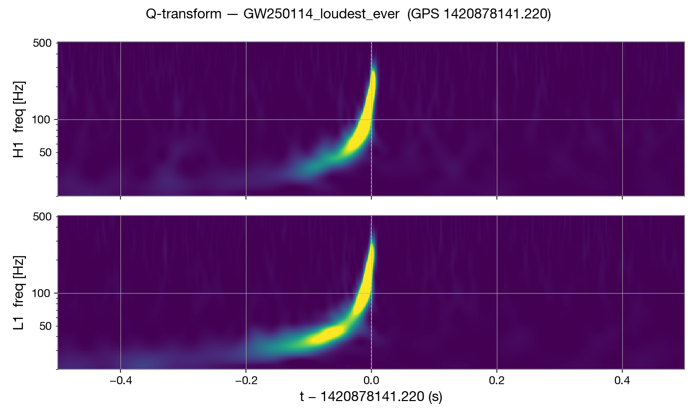
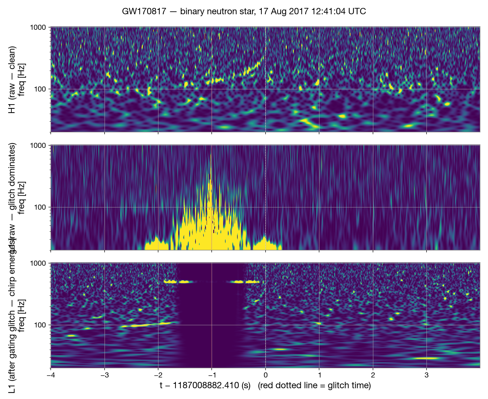
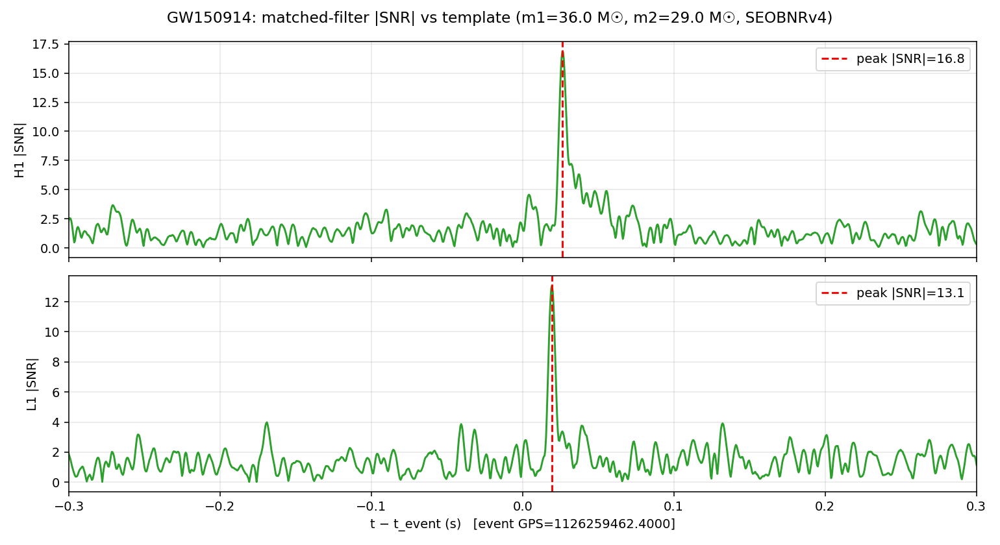

# gw-reproductions

Reproducing real gravitational-wave detections from public LIGO data, on a laptop.

This repo contains the code I used to recover four events from the LIGO/Virgo open data archive (GWOSC):

| Event | Date | Type | Network SNR (catalog) | Network SNR (this pipeline) |
|---|---|---|---|---|
| **GW150914** | 14 Sep 2015 | BBH (first ever) | ~24 | ~23 |
| **GW200129_065458** | 29 Jan 2020 | BBH | 26.5 | 25.5 |
| **GW250114_082203** | 14 Jan 2025 | BBH (loudest ever) | 78.6 | 76.8 |
| **GW170817** | 17 Aug 2017 | BNS + EM counterpart | 32.4 | 9.1 (after gating L1 glitch) |

All four events are recovered at the correct GPS time (within ±30 ms) and with templates whose masses match the catalog values.

## Showcase

**GW250114** — the loudest gravitational-wave signal ever recorded by humanity, January 2025. Two ~32-solar-mass black holes merging. Network SNR 78.6.



**GW170817** — first binary neutron star detected, August 2017. Multi-messenger event. The middle panel shows the famous L1 instrumental glitch that nearly broke the discovery; the bottom panel shows the chirp emerging after gating.



**GW150914** — the original detection from September 2015. Matched-filter SNR time series in both detectors, with the chirp peak clearly visible.



## What's here

| File | Purpose |
|---|---|
| `reproduce_gw150914.py` | Single-event reproduction of GW150914, the original detection |
| `o3_search.py` | Parametrized multi-event matched-filter pipeline (45-template bank, H1↔L1 coincidence, GWTC catalog cross-check). Supports phases: `smoke`, `known`, `blind`, `gw250114`, `gw170817` |
| `inspect_trigger.py` | Generic Q-transform spectrogram renderer for any GPS time |
| `inspect_gw170817.py` | 3-panel storytelling figure for GW170817 (H1 raw / L1 raw / L1 gated) |
| `results/images/` | Pre-computed PNGs for all events |
| `results/json/` | Pre-computed trigger logs and search statistics |
| `environment.yml` | Conda environment specification |

## Setup

Tested on macOS 26 (Apple Silicon) with miniforge3. Should also work on Linux x86_64.

```bash
# Install miniforge if you don't have conda
curl -fsSL -o miniforge.sh \
  "https://github.com/conda-forge/miniforge/releases/latest/download/Miniforge3-MacOSX-arm64.sh"
bash miniforge.sh -b -p ~/miniforge3

# Create the env
~/miniforge3/bin/mamba env create -f environment.yml
~/miniforge3/bin/conda run -n gw pip install "setuptools<81"  # pycbc needs pkg_resources

# Activate
source ~/miniforge3/etc/profile.d/conda.sh
conda activate gw
```

Total disk: ~1.8 GB (conda env) + ~500 MB (cached strain data after first run).

## Usage

### Reproduce GW150914 (the original 2015 detection)

```bash
python reproduce_gw150914.py
# writes output/1_raw_strain.png, output/2_whitened_strain.png, output/3_matched_filter_snr.png
```

### Run the multi-event search pipeline

```bash
python o3_search.py --phase smoke      # 10-min window near GW200129, sanity check
python o3_search.py --phase known      # 1-hour window around GW200129, full validation
python o3_search.py --phase blind      # 1-hour quiet window, methodology demo
python o3_search.py --phase gw250114   # 10-min window, the loudest GW event ever
python o3_search.py --phase gw170817   # 10-min window, BNS + L1 glitch gating
```

Each phase writes `output/phase_<name>_results.json` with the full trigger log.

### Render Q-transform spectrograms

```bash
python inspect_trigger.py --gps 1420878141.22 --label GW250114 --window 0.5
python inspect_gw170817.py    # 3-panel storytelling figure
```

## Pipeline architecture (`o3_search.py`)

1. Fetch H1 and L1 strain from GWOSC via `gwpy.timeseries.TimeSeries.fetch_open_data`
2. High-pass at 15 Hz, resample to 2048 Hz
3. Estimate PSD with Welch averaging, inverse-spectrum-truncation
4. Build template bank: uniform grid in (m1, m2) using IMRPhenomD
5. Per template, per detector: matched filter → SNR time series, find peaks above threshold
6. Time-coincidence between H1 and L1 within ±15 ms (light travel = 10 ms between sites)
7. Cluster coincident triggers (1-second window), rank by network SNR
8. Cross-check against published GWTC catalogs (1, 2, 2.1, 3)

This is a meaningfully simplified version of what the LIGO/PyCBC pipelines actually do. It is missing:

- χ² signal-consistency vetoes
- Time-slide background estimation → false-alarm rate
- Hexagonal template bank placement
- Spin parameters
- PSD drift handling

These are the natural next steps if you want to push the pipeline toward something that could realistically find new events.

## Caveats

- **Not a discovery tool.** Catalogs from LIGO/Virgo/KAGRA and from independent groups (e.g. the IAS group) have already searched O1/O2/O3 with much denser template banks. Anything this pipeline finds in those windows is either a catalog event or a glitch.
- **GW170817 SNRs are lower than published** because we use point-particle IMRPhenomD waveforms at f_lower=30 Hz rather than BNS tidal waveforms at f_lower=23 Hz. The event is still cleanly recovered with correct template masses.
- **GW250114 mass mismatch:** the coarse 45-template bank picks m1=45/m2=30 (catalog: m1=34/m2=32). The recovered SNR is still within 3% of catalog.

## Attribution

All strain data: **LIGO/Virgo/KAGRA Collaboration via the [Gravitational Wave Open Science Center](https://gwosc.org)**, released under CC0.

Analysis tools: [PyCBC](https://pycbc.org), [gwpy](https://gwpy.github.io).

Catalog papers: GWTC-3 — Abbott et al., *Phys. Rev. X* **13**, 041039 (2023).

> This research has made use of data, software and/or web tools obtained from the Gravitational Wave Open Science Center, a service of LIGO Laboratory, the LIGO Scientific Collaboration, the Virgo Collaboration, and KAGRA.

## License

MIT. See [LICENSE](LICENSE).
